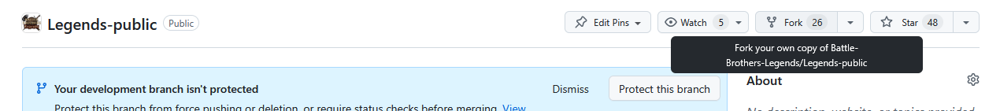
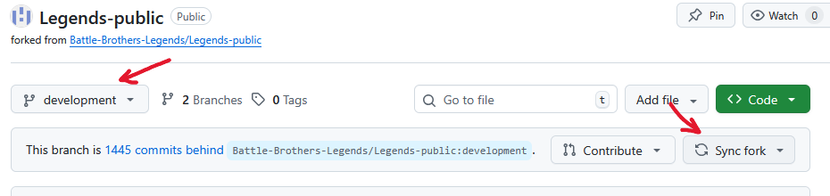
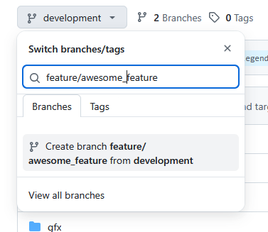
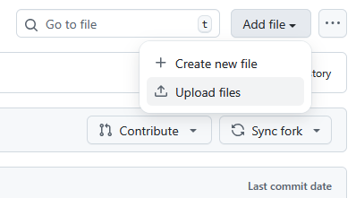
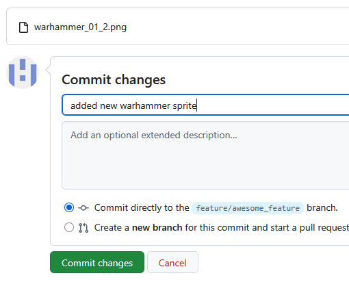
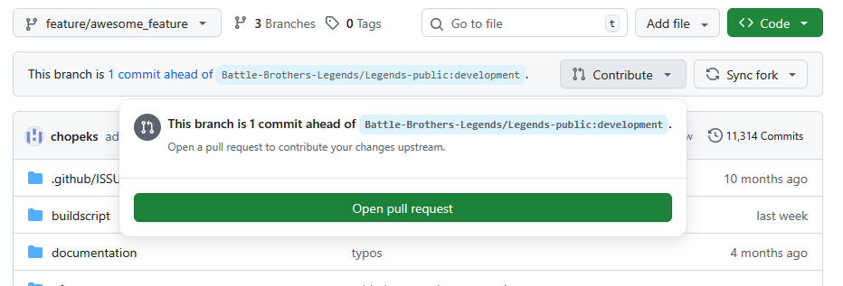
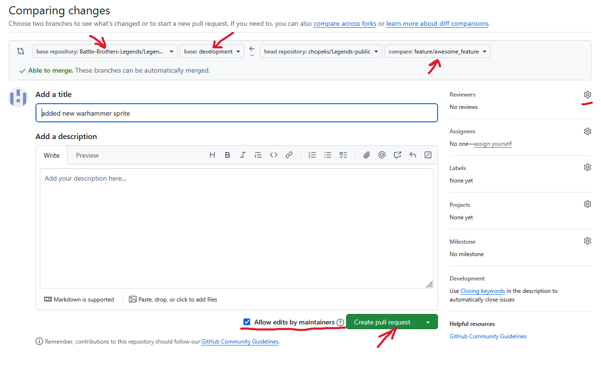

# Pull Request - Contributor Guide

## Prerequisites

Make sure you have GitHub account.

## Forking and Update

In case if you haven't working on Legends codebase before, you need a fork.

When your fork is created, make sure it's up to date with specific branch you want your changes to be uploaded to.

Make sure you've selected correct branch, development is future version, release/x.y.z is bugfix of current version; after that click `Sync fork` to update

Next you want to create new branch for your changes; click on branch dropdown, name it and click Create branch xxx

## Uploading changes

If you're uploading art, use links to navigate to directory where art is supposed to be, then click `Upload files`, then add description and click `Commit changes`.

For code changes, you can click edit icon when you open specific file, after changes commit same way as above.

## Pull Request

When you're done with your changes and want your changes to be reviewed by maintainers, and to be added or discussed, you need to create `Pull request`. Click on `Contribute` and `Open pull request`.
Navigate back to main page of your fork,

Make sure, left side dropdowns point to original repository and branch you started at; right side should point to your branch. Make sure you check `Allow edits by maintainers`, this makes our lives easier if we have conflicting changes during the merge.
If you're changing stuff you didn't discuss with maintainers, add description.
Reviewers are optional, it will just email us which we will ignore (true story). Click `Create pull request` when you're done, then ping us on Discord or wait.

